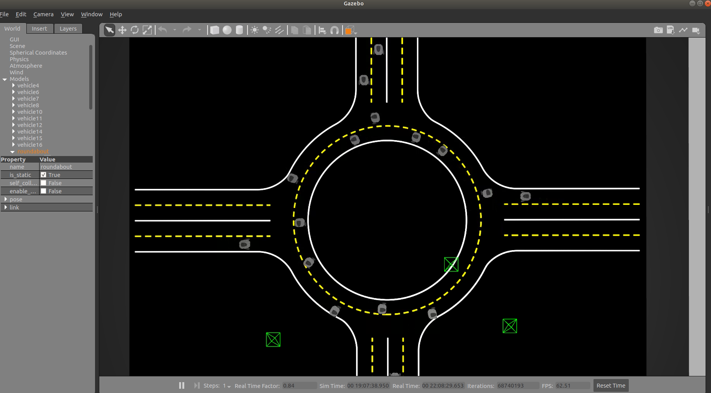

Getting Start with MRST
=======================

Before the installation, please check that your computer satfied the basic requirements:

- Ubuntu 16+
- GeForce 1080+
- C++ 8.0+

Frist, we need to install the ROS and gazebo

.. note:: This installation is for the beginner.
 If you already install the ros and gazebo, please skill this part.

.. highlight:: sh
::

    # Set up the key
    sudo apt install curl # if you haven't already installed curl
    curl -s https://raw.githubusercontent.com/ros/rosdistro/master/ros.asc | sudo apt-key add -

    # Install the ROS-melodic and turtlebot3 in Unbuntu 18
    sudo apt install ros-melodic-desktop-full
    sudo apt install ros-melodic-turtlebot3-*
    echo "source /opt/ros/melodic/setup.bash" >> ~/.bashrc
    source ~/.bashrc

    # Create catkin workspace
    mkdir -p ~/catkin_ws/src
    cd ~/catkin_ws/src
    catkin_init_workspace

Next, please clone our repository from `github <https://github.com/Blackmamba-xuan/MRST>`_ and move the floder **'mrst_simulation'** into **'catkin_ws/src'**. 

Build our simulation environment.

.. highlight:: sh
::

    cd ~/catkin_ws/src
    catkin_make

Then, we can use the ''roslaunch'' to launch the simulation environment. For example, we can launch the roundabout scenario with following command.

.. highlight:: sh
::

    roslaunch mrst_simulation turtlebot3_autorace_roundabout.launch
    roslaunch mrst_simulation turtlebot3_autorace_control_roundabout.launch

Finally, we can training our algorithmn using the API we provides. Here is a simple excample for coding.

.. highlight:: sh
::

    from Env import Env
    def main():
        env=Env(scenario="roundabout")
        n_episodes = 100
        n_agents=12
        episode_length=15
        for e in range(n_episodes):
            env.reset()
            for et_i in range(episode_length):
                print(et_i)
                actions=[[1] for i in range(n_agents)]
                next_obs, rewards, dones, speeds = env.step(actions, isTeamReward=True)
   if __name__ == "__main__":
      main()

In the next section, we will introduce the other scenarios we provided and the APIs for agent-envrionment interaction.